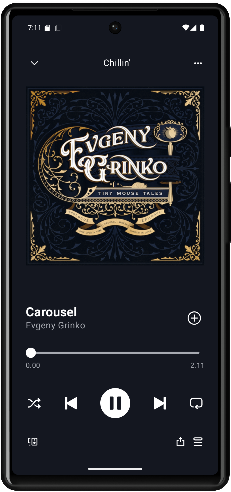

#  Spotify Player UI (Kotlin)

This is a non-functional Spotify-style music player UI built using Kotlin and Jetpack Compose. The project focuses solely on the visual layout and does not include any actual music playback functionality.

## 📱 Screenshot

## 🛠️ Features

- Modern Spotify-inspired user interface  
- Fully declarative UI with Jetpack Compose  
- Layout-only: no backend logic or real media functionality
- Includes album art, playback controls, and track information    
- Clean and simple project structure  

## ❗ Note

This project is intended for **UI demonstration purposes only**.  
It does not connect to the Spotify API or include any real media playback features.

## 🚀 How to Run

1. Clone this repository  
2. Open the project in Android Studio  
3. Run on an emulator or physical Android device  
4. Explore the Spotify-style layout  

## 🧰 Tech Stack

- Kotlin  
- Jetpack Compose  
- Android Studio  

